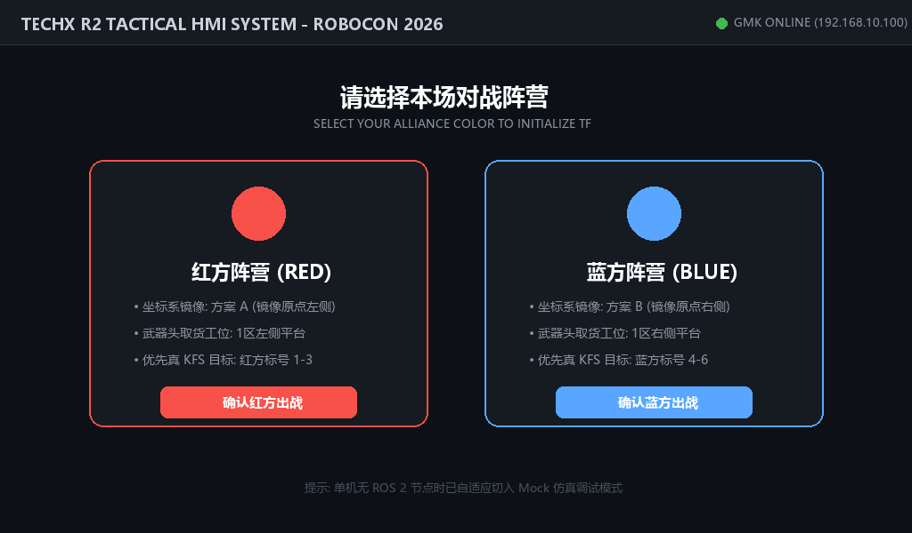
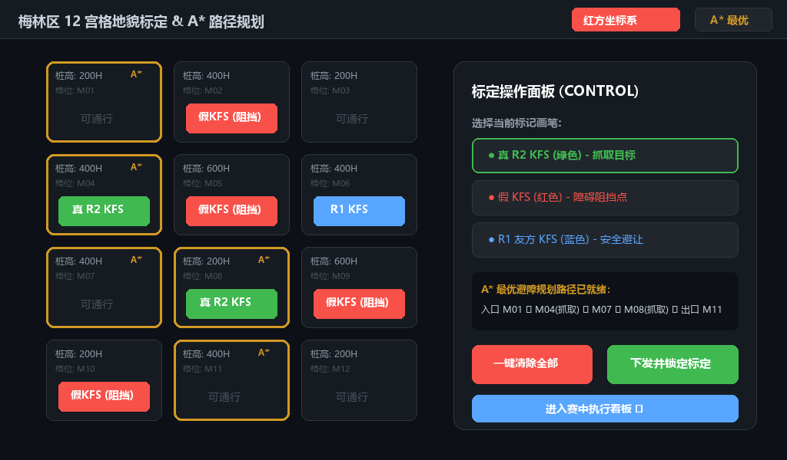
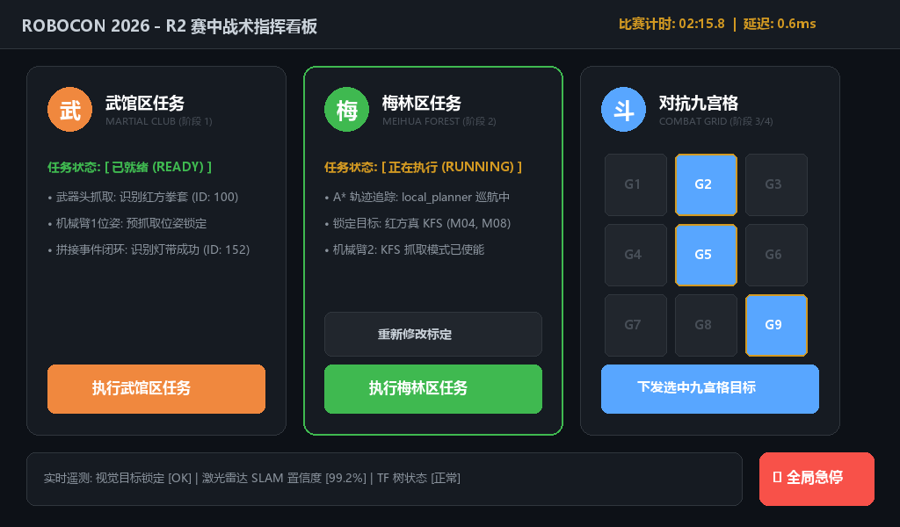

# R2 HMI - ROBOCON 2026 战术指挥系统

> 本系统为 ROBOCON 2026 参赛战车 **TechX R2** 的车载触控战术中枢。  
> 采用 **PySide6 + QML 现代化扁平视觉** 打造，深度融合 ROS 2 Action / Service 机制，配备离线 Mock 模拟器。

---

## 📸 核心界面效果展示

### 1. 阵营选择界面 (`BootPage.qml`)

* **红/蓝双选卡片**：一键切换整车地图与坐标系镜像；
* **自动参数载入**：根据阵营自动锁定武器头取货台与优先识别的真 KFS 编号。

### 2. 梅林区 12 宫格地貌标定 & A* 最优路径规划 (`CalibrationPage.qml`)

* **触控画笔体系**：
  * 🟢 **真 R2 KFS（绿色）**：目标抓取矿石，可通过；
  * 🔴 **假 KFS（红色）**：阻挡不可通行（障碍物）；
  * 🔵 **R1 KFS（蓝色）**：友方矿石，安全避让通行。
* **内置 A* 最优避障搜索**：
  * 结合 200H / 400H / 600H 柱高代价与曼哈顿启发式距离；
  * 动态解算入口到出口的最优无碰撞轨迹，**在网格上呈现醒目的金色发光高亮路径**。

### 3. 赛中战术指挥看板 (`DashboardPage.qml`)

* **武馆区卡片**：一键执行武器头视觉对齐、抓取与装配闭环；
* **梅林区卡片**：实时展示 A* 巡航进度与目标真 KFS 锁定状态，支持一键回跳修改标定；
* **对抗区 3x3 九宫格**：支持多选目标坑位并批量下发投递动作；
* **全局急停机制**：右下角常驻红色大尺寸急停按键，一键锁死全车执行机构。

---

## 🛠️ 环境要求与运行

### 1. 依赖安装
```bash
pip install PySide6
```

### 2. 本地启动
```bash
cd r2_hmi_app
python3 main.py
```
* **自适应 Mock 模式**：检测到无 ROS 2 节点时自动启用虚拟数据驱动，所有界面按钮、A* 路径解算与状态流转均可离线完整测试。

---

## 📂 项目结构
```text
hmi/
├── README.md                      # 本设计与交互说明
├── r2_hmi_core/                   # ROS 2 接口定义包
│   ├── action/ExecuteStage.action # 赛段长周期动作
│   └── srv/SyncCalibration.srv    # 标定数据同步服务
│
└── r2_hmi_app/                    # PySide6 + QML 上位机应用
    ├── main.py                    # 应用入口
    ├── frontend/                  # QML 视图层
    │   ├── Main.qml               # 主窗口容器
    │   ├── BootPage.qml           # 阵营选择页
    │   ├── CalibrationPage.qml    # 梅林标定页 (含 A* 寻路算法)
    │   ├── DashboardPage.qml      # 赛中综合看板
    │   └── components/            # 可复用组件 (CombatGrid, StageCard, StyleConstants)
    └── backend/                   # Python 业务层 (ros_worker, ros_compat)
```
