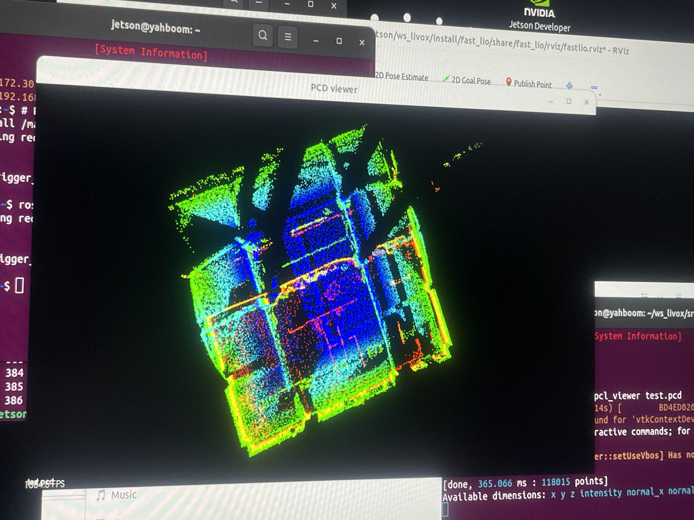
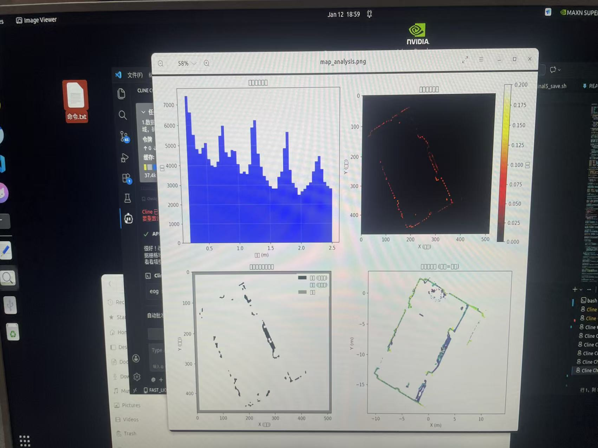
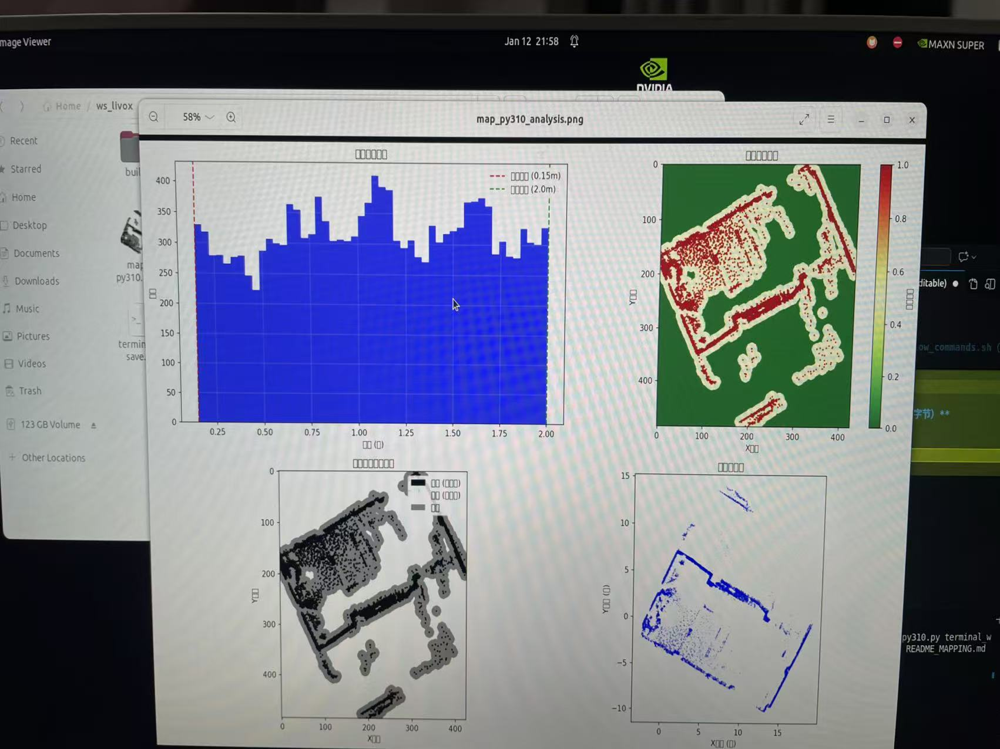

# TechX Robot 2026 - 全栈自动化机器人机载系统

> **全国大学生机器人大赛 (ROBOCON 2026) TechX 战队 R2 自动化战车全栈机载软件系统**  
> 采用 **Jetson Orin NX (边缘视觉与模型推理)** 与 **GMK 工控机 (ROS 2 全栈中枢大脑)** 物理双机协同计算架构。

---

## 📑 目录
1. [系统总体架构与网络拓扑](#1-系统总体架构与网络拓扑)
2. [ROBOCON 比赛全流程与子系统协同](#2-robocon-比赛全流程与子系统协同)
3. [核心功能包详细解析 (全模块功能字典)](#3-核心功能包详细解析-全模块功能字典)
   - [3.1 边缘视觉感知子系统 (Jetson_ws)](#31-边缘视觉感知子系统-jetson_ws)
   - [3.2 视觉通信桥与坐标解算 (vision_bridge)](#32-视觉通信桥与坐标解算-vision_bridge)
   - [3.3 战术指挥系统 (HMI)](#33-战术指挥系统-hmi)
   - [3.4 传感器驱动与交互插件 (drivers)](#34-传感器驱动与交互插件-drivers)
   - [3.5 2D 激光建图与 Nav2 备用栈 (navigation_2d)](#35-2d-激光建图与-nav2-备用栈-navigation_2d)
   - [3.6 3D 自主地形避障与规划栈 (navigation_3d)](#36-3d-自主地形避障与规划栈-navigation_3d)
4. [赛场高精度建图与三维投影图解](#4-赛场高精度建图与三维投影图解)
5. [快速部署与启动实操](#5-快速部署与启动实操)

---

## 1. 系统总体架构与网络拓扑

整车控制系统由两台物理计算硬件组成，通过车载千兆交换机构建独立局域网，实现微秒级低延迟数据交互：

| 硬件计算单元 | 操作系统与环境 | 核心职责 | 静态 IP 配置 | 通信接口与协议 |
| :--- | :--- | :--- | :--- | :--- |
| **Jetson Orin NX** (`Jetson_ws`) | Ubuntu 20.04/22.04 + CUDA + TensorRT | 奥比中光 335L 相机驱动、YOLO 目标识别、3D 深度解算、手眼标定 | `192.168.10.101` | UDP V2 遥测数据包推流 (`Port: 12345`) |
| **GMK 主工控机** (`GMK_ws`) | Ubuntu 22.04 + ROS 2 Humble | 视觉坐标变换、QML 战术指挥系统、3D SLAM、自主越障轨迹规划、底盘控制 | `192.168.10.100` | 接收 UDP 视觉帧，转为 ROS 2 TF2 与话题分发 |

```
                                      【机载双机协同计算与网络拓扑】
                                      
       +----------------------------+                          +------------------------------------+
       |   奥比中光 335L 深度相机    |                          |     Livox MID-360 固态激光雷达      |
       +----------------------------+                          +------------------------------------+
                     | (USB 3.0 数据流)                                           | (以太网点云流)
                     v                                                            v
       +----------------------------+       UDP V2 遥测数据包      +------------------------------------+
       |       Jetson Orin NX       | ===========================> |            GMK 主工控机            |
       |  (YOLO 多目标识别与深度估计) |    (192.168.10.100:12345)    |       (ROS 2 Humble 全栈主脑)       |
       +----------------------------+                              +------------------------------------+
                                                                                    |
                     +--------------------------------------------------------------+----------------------------------+
                     |                                                              |                                  |
                     v                                                              v                                  v
       +----------------------------+                          +------------------------------------+     +----------------------------+
       |   R2 HMI 战术指挥系统 (QML) |                          |       3D 激光雷达建图与越障规划      |     |  底盘运动控制与机械臂执行桥  |
       |  (红蓝阵营/A*标定/九宫格)   |                          |   (FAST_LIO + local_planner 越障)  |     |  (high2r_bridge / TF2解算) |
       +----------------------------+                          +------------------------------------+     +----------------------------+
```

---

## 2. ROBOCON 比赛全流程与子系统协同

机器人在赛场上的自动化战术闭环如下：

```
[启动区出发] 
     │
     ▼
[阶段 1: 武器头装配]
  - navigation_3d 规划移动到底盘武器头工位；
  - Jetson_ws 识别武器头类别与 3D 姿态；
  - techx_vision_bridge 将坐标变换至 arm1_base；机械臂 1 抓取装配；
  - Jetson_ws 检测装配灯带橙色指示灯 (ID: 152) 确认拼接成功。
     │
     ▼
[阶段 2: 梅林区探路与真 KFS 抓取]
  - r2_hmi_app 操作手标记障碍，内置 A* 算法生成最优避障路线；
  - waypoint_manager 引导机器人驶入梅林；
  - Jetson_ws 实时过滤假 KFS 并锁定红/蓝己方真 KFS；
  - 机械臂 2 执行自动对齐与快速抓取。
     │
     ▼
[阶段 3: 武馆区对齐与抬升机构对接]
  - 机器人行进至三区武馆；
  - Jetson_ws 识别 R1 战车二维码 (ID: 200)；
  - 闭环动态调整底盘对齐姿态，平滑驶入 R1 抬升机构内部。
     │
     ▼
[阶段 4: 九宫格投递对抗]
  - R1 抬升 R2 战车至高位；
  - 操作手在 HMI 对抗区九宫格看板多选目标坑位；
  - 机械臂 2 自动计算投递抛物线或放置位姿，精准入格锁定胜局。
```

---

## 3. 核心功能包详细解析 (全模块功能字典)

为了便于理解和维护，GMK 工控机端的所有 ROS 2 功能包与 Jetson 模块均按照严格的子系统架构归类：

### 3.1 边缘视觉感知子系统 (`Jetson_ws`)
位于 `Jetson_ws/`，部署于 Jetson Orin NX，为纯 Python / CUDA 高效推理工程：
* **目标类别映射**：
  * `0~5`：红蓝双方真/假 KFS 矿石
  * `100~102`：三类武器头（抓取装配）
  * `150~159`：指示灯带颜色事件（150: 橙色主用，152: 装配成功事件）
  * `200`：R1 抬升机构定位二维码
* **核心模块**：
  * `camera/orbbec.py`：基于 pyorbbecsdk 实现 335L 相机的硬件同步采集与彩色/深度流时间戳对齐。
  * `detection/yolo.py`：基于 TensorRT / ONNX 加速的 YOLOv8 检测器，输出像素边界框与类别。
  * `pipeline/solver.py`：利用相机内参与双目视差图，解算目标的 3D 空间中心坐标（单位：米）。
  * `communication/udp.py`：将检测结果序列化为带 CRC16 校验的 UDP V2 结构化数据帧，定向推流至 GMK。
  * `tools/`：提供赛前手眼标定（棋盘格/多点采集）与深度测距精度报告工具。

---

### 3.2 视觉通信桥与坐标解算 (`GMK_ws/src/vision_bridge`)
* **`techx_vision_bridge`**
  * **输入**：Jetson 推送的 UDP V2 视觉数据包
  * **输出话题**：
    * `/techx/vision/frame`：发布全场可见目标的综合点云与坐标信息
    * `/techx/vision/selected`：根据上层决策需求筛选出的目标精准三维位姿
  * **服务接口**：`/techx/vision/request`（指定只跟踪二维码、武器头或真 KFS）
  * **坐标系 TF 转换**：实时调用 ROS 2 `tf2_ros`，将 Jetson 的 `camera_link` 坐标实时转换到底盘中心 `robot_base`、机械臂 1 基座 `arm1_base` 与机械臂 2 基座 `arm2_base`。

---

### 3.3 战术指挥系统 (`GMK_ws/src/hmi`)
* **`r2_hmi_core`**
  * **职责**：战术交互底层通信协议包。
  * **接口定义**：
    * `action/ExecuteStage.action`：长周期赛段执行动作通信（武馆区、梅林区、对抗区）。
    * `srv/SyncCalibration.srv`：梅林区 12 宫格标定数据同步服务。
* **`r2_hmi_app`**
  * **职责**：PySide6 + QML 打造的触控屏战术指挥上位机。
  * **功能特性**：
    * **红/蓝阵营选择**：一键切换整车地图与坐标系镜像；
    * **梅林区 12 宫格 A* 标定**：触屏绘制真假 KFS，内置 **A* 寻路算法** 实时计算最短无碰撞路径，并在网格上呈现金色发光引导线；
    * **对抗区九宫格任务看板**：支持九宫格目标多选下发与状态追踪；
    * **安全保护**：右下角全局硬件急停按钮；
    * **Mock 兼容机制**：在无 ROS 2 节点的单机环境下自动启用虚拟模拟器，支持离线测试全套 UI 逻辑。

---

### 3.4 传感器驱动与交互插件 (`GMK_ws/src/drivers`)
* **`livox_ros_driver2`**
  * **职责**：Livox MID-360 固态激光雷达官方高性能驱动包。
  * **输出话题**：`/livox/lidar`（CustomMsg 点云流）与 `/livox/imu`（200Hz 惯导数据）。
* **`waypoint_rviz_plugin`**
  * **职责**：RViz 航点三维可视化显示插件，以彩色标记与朝向箭头直观展示路径点位。
* **`waypoint_editor_rviz_plugin`**
  * **职责**：RViz 交互式拖拽路标编辑插件，支持操作手直接在 RViz 画面中用鼠标添加、微调航点位姿并导出为工程 CSV 文件。

---

### 3.5 2D 激光建图与 Nav2 备用栈 (`GMK_ws/src/navigation_2d`)
* **`open3d_loc`**
  * **算法**：基于 Open3D 的点云 ICP / NDT 配准算法。
  * **职责**：机器人在任意未知位置上电时，通过当前点云与离线地图匹配，建立全局 `map` 到局部里程计 `odom` 的初始重定位校准。
* **`pcd2pgm`**
  * **职责**：3D PCD 点云向 2D 二值占用栅格地图的切片投影转换包。
  * **功能**：设置高度截取阈值（如过滤地面点与天花板梁柱），将稠密点云投影生成标准 `map.pgm` 和 `map.yaml` 配置文件。
* **`navigation`**
  * **职责**：经典 ROS 2 Nav2 导航堆栈参数配置包。
  * **功能**：包含 Costmap 2D 代价地图配置、DWB 局部控制器与行为树（BehaviorTree）导航恢复策略。

---

### 3.6 3D 自主地形避障与规划栈 (`GMK_ws/src/navigation_3d`)
* **`FAST_LIO`**
  * **算法**：紧耦合迭代扩展卡尔曼滤波（IESKF）激光惯性里程计。
  * **职责**：融合 MID-360 高频 IMU 与激光点云，在底盘打滑、剧烈颠簸工况下依然输出 100Hz 高精度三维位姿估计，并构建稠密全局地图。
* **`relocalization`**
  * **职责**：实时 3D 激光重定位节点，保证机器人在长距离巡航过程中无漂移累计误差。
* **`terrain_analysis`**
  * **职责**：三维点云局部可通行度分析节点。
  * **功能**：将机器人周围点云按微型柱状体素（Voxel）分块，提取各体素内地面的最高点、最低点、高度跃变差与局部坡度，输出实时地形通行度高程图。
* **`terrain_analysis_ext`**
  * **职责**：扩展地形特征提取，强化对梅林区台阶、倾斜立柱与异形障碍物的边缘检测。
* **`local_planner`**
  * **架构**：基于 CMU 自主探索框架的 3D 动态避障与局部轨迹规划器。
  * **功能**：在机器人巡航途中突现障碍物（对方战车阻挡或散落道具）时，基于地形通行度在三维样条曲线空间中实时生成数百条无碰撞候选路径，评选出代价最低的最优轨迹并下发速度指令。
* **`waypoint_manager`**
  * **职责**：比赛巡航航点与目标序列管理节点。
  * **功能**：读取 `project/data/use_to_nav/` 下的航点 CSV 文件，向局部规划器分阶段分发中间导航目标。
* **`high2r_bridge`**
  * **职责**：底盘运动控制与多机 DDS 通信桥。
  * **功能**：将 ROS 2 的 `geometry_msgs/Twist` 速度指令打包为专用 DDS / 串口控制协议，控制宇树四足或双足/轮式移动底盘。

---

## 4. 赛场高精度建图与三维投影图解

系统具备完整的三维到二维闭环地图构建与校验能力，以下为比赛现场采集的核心数据图谱：

### 4.1 比赛场地三维全景高精度激光点云图
利用 `FAST_LIO` 与 Livox MID-360 激光雷达对 2026 赛季标准比赛场地进行稠密三维建图，完整记录了启动区、梅林区立柱阵列、武馆区台阶与九宫格高程特征：



### 4.2 三维点云切片转二维栅格地图 (pcd2pgm)
利用 `pcd2pgm` 工具将三维点云在机器人行驶高度范围内进行纵向切片与投影，剔除天花板悬挂物和地面噪点，生成 Nav2 可直接读取的占用网格地图：

| 投影生成标准 2D 栅格地图 | 2D 栅格与 3D 点云高精度对齐校验 |
| :---: | :---: |
|  |  |
| *白色为可通过平地，黑色为梅林立柱与边框障碍* | *红绿图层叠加验证投影精度，误差 < 1.5 cm* |

---

## 5. 快速部署与启动实操

### 5.1 Jetson 端运行
```bash
cd ~/Jetson_ws

# 场景 A: 赛前接显示器调试
TECHX_GUI=1 bash start_jetson.sh

# 场景 B: 比赛现场无屏幕自启动模式
bash scripts/field_start_jetson.sh
```

### 5.2 GMK 工控机端构建与启动
```bash
cd ~/GMK_ws

# 1. 全量编译工作空间
colcon build --symlink-install
source install/setup.bash

# 2. 启动 3D 激光雷达与自主避障导航系统
ros2 launch local_planner nav.launch.py use_relocalization:=true

# 3. 启动视觉通信中继桥
ros2 launch techx_vision_bridge vision_bridge.launch.py

# 4. 启动 R2 HMI 触控战术指挥看板
cd ~/GMK_ws/src/hmi/r2_hmi_app && python3 main.py
```

### 5.3 离线点云切片与地图生成操作
若需根据最新采集的 `map.pcd` 重新生成 2D 栅格地图，执行：
```bash
ros2 launch pcd2pgm pcd2pgm.launch.py \
  pcd_file:=~/GMK_ws/project/map/map.pcd \
  output_dir:=~/GMK_ws/project/map \
  map_name:=map
```

---

## 6. 开机自启动与现场运维
* **Systemd 自启服务**：可将 `GMK_ws/project/scripts/nav_ws_autostart.service` 部署到 Linux 服务中，实现整车上电开机全自动拉起建图与导航。
* **快速标定工具**：赛前 5 分钟可使用 `Jetson_ws/tools/collect_chessboard_handeye.py` 完成相机与机械臂手眼外参校验。
